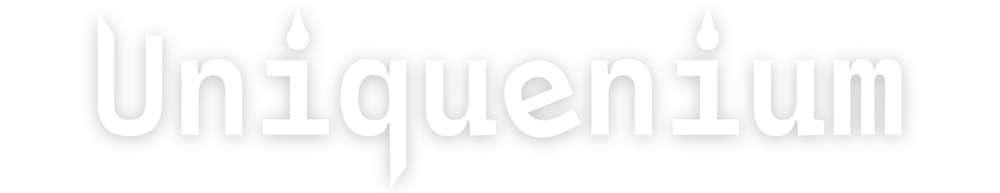
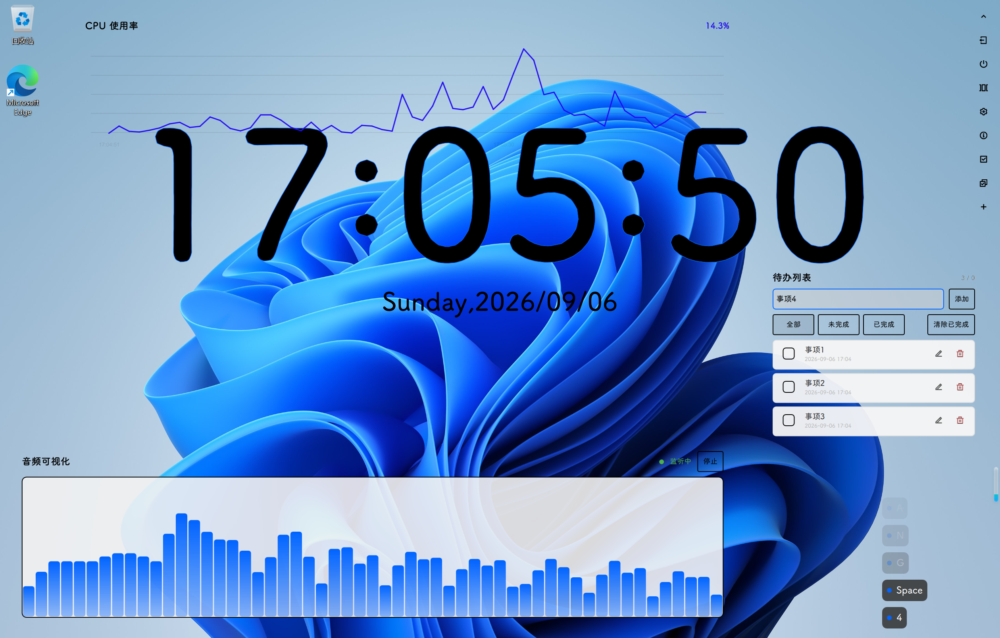

<h1>Uniquenium</h1>

[官方文档](https://docs.uniquenium.qyadbr.top) ·
[DeepWiki 文档](https://deepwiki.com/Uniquenium/Uniquenium) ·
[English](./README.md) ·
[待办列表](./TODO.md)

高度自由的开源桌面自定义工具

# 效果图

# 依赖项

- [exprtk](https://github.com/ArashPartow/exprtk)
- QHotkey
- Extra Cmake Modules

# 致谢

[Admibrill](https://github.com/admibrill)，项目发起人。

[Remix Icons](https://www.remixicon.cn/collection)，提供图标。

[LingmoUI](https://github.com/LingmoOS/LingmoUI)，UI库原型。
