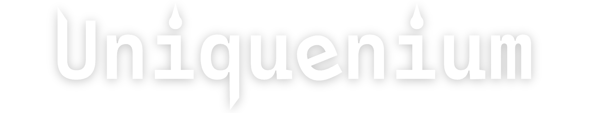

<h1>Uniquenium</h1>

[Official Docs](https://docs.uniquenium.qyadbr.top) ·
[DeepWiki Docs](https://deepwiki.com/Uniquenium/Uniquenium) ·
[中文](./README-ZH_CN.md)

An open-source desktop extension tool that combines beautification and practical functions

# Todo List
- [ ] Main Page
    - [ ] Exit
    - [x] System 
        - [x] Shutdown
        - [x] Restart
        - [x] Sleep
        - [ ] Update
        - [x] Log Off
        - [x] Lock Screen
    - [x] Pages View
        - [ ] Manage Pages
    - [ ] Settings
        - [ ] System
        - [ ] Appearance
        - [ ] Behavior
        - [ ] Hotkeys
        - [ ] About
    - [x] New Component
- [ ] Controls
- [ ] Basic Components
    - [ ] Text
    - [ ] Button
    - [ ] Image
    - [ ] Chart(CPU,GPU,Network status,etc.)
    - [ ] Frame
    - [ ] Group
- [ ] Extra Components
    - [ ] Calculator
    - [ ] Screen Capture
    - [ ] Color Picker
    - [ ] Translator
    - [ ] Music
    - [ ] Todo List
    - [ ] Explorer
    - [ ] Typing Follower
    - [ ] Work Sheets
    - [ ] Calendar
    - [ ] Schedule
    - [ ] Notepad
    - [ ] Codepad
    - [ ] Rapid File Downloader
    - [ ] RSS
    - [ ] Screen Using Time

# Acknowledgements

[Admibrill](https://github.com/admibrill),the starter of the project.

[Remix Icons](https://www.remixicon.cn/collection),provides the icons.
